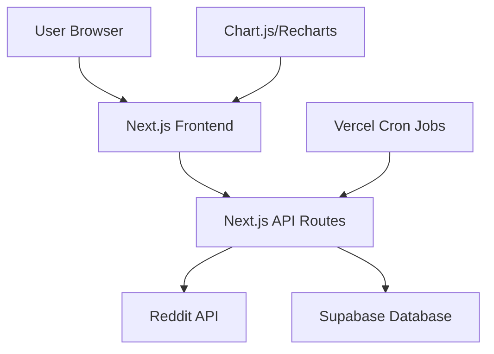

# Design Document

## Overview

The Reddit Karma Tracker is a full-stack web application built with Next.js, deployed on Vercel, and using Supabase for data persistence. The system consists of a React frontend for data visualization, a Next.js API backend for Reddit data fetching, and scheduled functions for automated data collection.

## Architecture

### High-Level Architecture



### Technology Stack

- **Frontend**: Next.js 14 with React, TypeScript, Tailwind CSS
- **Charts**: Recharts for interactive data visualization
- **Backend**: Next.js API routes
- **Database**: Supabase (PostgreSQL)
- **Hosting**: Vercel
- **Scheduling**: Vercel Cron Jobs
- **HTTP Client**: Axios for Reddit API calls

## Components and Interfaces

### Frontend Components

#### 1. UserManagement Component
- **Purpose**: Add/remove Reddit usernames from tracking list
- **Props**: `users: string[]`, `onAddUser: (username: string) => void`, `onRemoveUser: (username: string) => void`
- **State**: Input validation, loading states, username verification
- **Features**: 
  - Input field with validation for Reddit username format
  - Add button with loading state during verification
  - List of currently tracked users with remove buttons
  - Duplicate prevention and error messaging
  - Real-time validation against Reddit API to ensure user exists

#### 2. UserChart Component
- **Purpose**: Display individual user karma/post history
- **Props**: `username: string`, `data: HistoryData[]`, `metric: 'karma' | 'posts'`
- **Features**: Interactive tooltips, time range selection

#### 3. CombinedChart Component
- **Purpose**: Display overlaid charts for multiple users
- **Props**: `users: string[]`, `data: Record<string, HistoryData[]>`, `metric: 'karma' | 'posts'`
- **Features**: Color-coded lines, legend, zoom functionality

#### 4. Dashboard Component
- **Purpose**: Main application layout and state management
- **State**: Tracked users, chart data, view mode (individual/combined)

### Backend API Routes

#### 1. `/api/users` (GET, POST, DELETE)
- **GET**: Retrieve list of tracked users
- **POST**: Add new user to tracking
- **DELETE**: Remove user from tracking

#### 2. `/api/users/[username]/history` (GET)
- **Purpose**: Fetch historical data for specific user
- **Response**: Array of timestamped karma/post data

#### 3. `/api/reddit/user/[username]` (GET)
- **Purpose**: Fetch current Reddit user data
- **Response**: Current karma and post count

#### 4. `/api/cron/collect-data` (POST)
- **Purpose**: Scheduled data collection endpoint
- **Function**: Fetch data for all tracked users and store in database

## Data Models

### Database Schema (Supabase)

#### tracked_users table
```sql
CREATE TABLE tracked_users (
  id UUID PRIMARY KEY DEFAULT gen_random_uuid(),
  username VARCHAR(50) UNIQUE NOT NULL,
  created_at TIMESTAMP DEFAULT NOW(),
  is_active BOOLEAN DEFAULT TRUE
);
```

#### user_history table
```sql
CREATE TABLE user_history (
  id UUID PRIMARY KEY DEFAULT gen_random_uuid(),
  username VARCHAR(50) REFERENCES tracked_users(username),
  karma INTEGER NOT NULL,
  post_count INTEGER NOT NULL,
  collected_at TIMESTAMP DEFAULT NOW(),
  INDEX idx_username_date (username, collected_at)
);
```

### TypeScript Interfaces

```typescript
interface TrackedUser {
  id: string;
  username: string;
  created_at: string;
  is_active: boolean;
}

interface HistoryData {
  id: string;
  username: string;
  karma: number;
  post_count: number;
  collected_at: string;
}

interface RedditUserData {
  username: string;
  karma: number;
  post_count: number;
}

interface ChartDataPoint {
  date: string;
  karma: number;
  posts: number;
  username: string;
}
```

## Error Handling

### Reddit API Error Handling
- **Rate Limiting**: Implement exponential backoff with 3 retry attempts
- **User Not Found**: Return 404 with appropriate error message
- **API Unavailable**: Log error and continue with other users
- **Invalid Response**: Validate response structure before processing

### Database Error Handling
- **Connection Issues**: Retry database operations with circuit breaker pattern
- **Constraint Violations**: Handle duplicate username additions gracefully
- **Query Failures**: Log errors and return appropriate HTTP status codes

### Frontend Error Handling
- **Network Errors**: Display user-friendly error messages with retry options
- **Invalid Input**: Client-side validation with immediate feedback
- **Loading States**: Show spinners and skeleton screens during data fetching
- **Empty States**: Provide clear guidance when no data is available

## Testing Strategy

### Unit Tests
- **Components**: Test rendering, user interactions, and prop handling
- **API Routes**: Test request/response handling and error scenarios
- **Utilities**: Test data transformation and validation functions
- **Database Operations**: Test CRUD operations and error handling

### Integration Tests
- **API Integration**: Test complete request flows from frontend to database
- **Reddit API Integration**: Test data fetching and error handling
- **Chart Rendering**: Test data visualization with various data sets

### End-to-End Tests
- **User Workflows**: Test complete user journeys (add user, view charts, remove user)
- **Data Collection**: Test scheduled data collection process
- **Responsive Design**: Test functionality across different screen sizes

### Performance Testing
- **Chart Rendering**: Test performance with large datasets (1000+ data points)
- **API Response Times**: Ensure sub-2-second response times
- **Database Queries**: Optimize queries for historical data retrieval

## Deployment and Infrastructure

### Vercel Configuration
- **Build Settings**: Next.js build with TypeScript compilation
- **Environment Variables**: Supabase credentials, Reddit API keys
- **Cron Jobs**: Daily data collection at 6 AM UTC
- **Edge Functions**: Consider for Reddit API calls to reduce latency

### Supabase Configuration
- **Database**: PostgreSQL with connection pooling
- **Row Level Security**: Enable for data protection
- **Indexes**: Optimize for time-series queries
- **Backup**: Automatic daily backups

### Monitoring and Logging
- **Error Tracking**: Implement error logging for API failures
- **Performance Monitoring**: Track API response times and database query performance
- **Usage Analytics**: Monitor user engagement and feature usage
- **Alerting**: Set up alerts for API failures and database issues